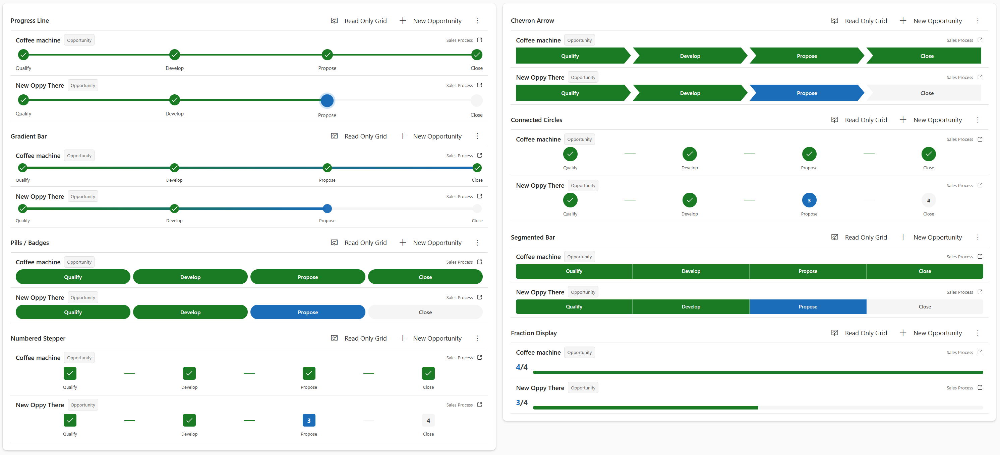

<p align="center">
  
</p>

<h1 align="center">Business Process Flow Viewer</h1>

<p align="center">
  <strong>Visualize BPF stages for records in grid and subgrid views</strong>
</p>

<p align="center">
  
  
  <a href="https://github.com/allandecastro/business-process-flow-viewer/actions/workflows/ci.yml"></a>
  <a href="https://github.com/allandecastro/business-process-flow-viewer/actions/workflows/cd.yml"></a>
</p>

<p align="center">
  
  
  
</p>

<p align="center">
  
  
  
</p>

<p align="center">
  <a href="#installation">Installation</a> &bull;
  <a href="#design-styles">Design Styles</a> &bull;
  <a href="#configuration">Configuration</a> &bull;
  <a href="#performance">Performance</a> &bull;
  <a href="#development">Development</a> &bull;
  <a href="#contributing">Contributing</a>
</p>

---

## Preview

<p align="center">
  
</p>

<p align="center">
  <em>Visualize business process flow stages directly in grid and subgrid views</em>
</p>

---

## Highlights

| Feature | v1 (2020) | Current |
|---------|-----------|-----------|
| Architecture | Standard PCF | **Virtual PCF** |
| UI Library | Custom CSS | **Fluent UI v9** |
| Framework | Vanilla JS | **React 16.14** |
| Theming | Custom colors only | **Platform theme support** |
| Dataverse Calls | 1 per record | **Batched + parallel** |
| Bundle Size | ~150KB | **~20KB** (shared libs) |
| Design Options | 1 | **8 designs** |
| Responsive | No | **Container-based** |

---

## Design Styles

| Style | Description |
|-------|-------------|
| `chevron` | Classic BPF ribbon arrows (default) |
| `circles` | Connected circles with labels |
| `pills` | Rounded badge style |
| `segmented` | Single segmented progress bar |
| `stepper` | Numbered boxes with connectors |
| `gradient` | Gradient progress bar with markers |
| `line` | Linear progress track with markers |
| `fraction` | Fraction display (e.g. 2/5) |

---

## Installation

Choose your preferred installation method:

### Option 1: Quick Install (Recommended)

Download and import the pre-built managed solution directly into your Dataverse environment.

<p align="center">
  <a href="https://github.com/allandecastro/business-process-flow-viewer/releases/latest">
    
  </a>
</p>

1. Download `BusinessProcessFlowViewer_x.x.x_managed.zip` from [Releases](https://github.com/allandecastro/business-process-flow-viewer/releases)
2. Go to [make.powerapps.com](https://make.powerapps.com) &rarr; Select your environment
3. Navigate to **Solutions** &rarr; Click **Import solution**
4. Browse and select the downloaded `.zip` file
5. Click **Next** &rarr; **Import**

**Using PAC CLI:**

```bash
pac auth create --environment "https://yourorg.crm.dynamics.com"
pac solution import --path BusinessProcessFlowViewer_x.x.x_managed.zip
```

### Option 2: Build from Source

```bash
git clone https://github.com/allandecastro/business-process-flow-viewer.git
cd business-process-flow-viewer
npm install
npm run build
```

### Add to a Grid or Subgrid

After importing the solution:

1. Open a **Model-Driven App** in the app designer
2. Select a **Grid** or **Subgrid** view
3. Click **Get more components** &rarr; search for **BusinessProcessFlowViewer**
4. Configure the BPF JSON parameter (see [Configuration](#configuration))
5. **Save** and **Publish**

---

## Configuration

### BPF Configuration (JSON)

The `parametersBPF` property accepts a JSON configuration that tells the control which BPF entities to query:

```json
{
  "bpfs": [
    {
      "bpfEntitySchemaName": "opportunitysalesprocess",
      "lookupFieldSchemaName": "_opportunityid_value"
    }
  ]
}
```

| Field | Description |
|-------|-------------|
| `bpfEntitySchemaName` | Schema name of the BPF entity (e.g. `opportunitysalesprocess`) |
| `lookupFieldSchemaName` | Lookup field on the BPF entity that references the parent record (e.g. `_opportunityid_value`) |

Multiple BPF definitions can be configured for entities with more than one business process flow.

### All Properties

| Property | Type | Default | Description |
|----------|------|---------|-------------|
| `parametersBPF` | String | - | JSON configuration for BPFs |
| `designStyle` | Enum | `chevron` | Visual design style |
| `displayMode` | Enum | `stage` | Show stage or category names |
| `recordNameSize` | Enum | `medium` | Record name font size (small/medium/large) |
| `showEntityName` | Enum | `no` | Show entity type badge next to record name |
| `enableNavigation` | Enum | `yes` | Click row to open record in new tab |
| `showPulseAnimation` | Enum | `yes` | Subtle animation on active stage |
| `usePlatformTheme` | Enum | `yes` | Use Dataverse environment theme colors |
| `completedColor` | String | `#107C10` | Completed stage background color |
| `completedTextColor` | String | `#FFFFFF` | Completed stage text color |
| `activeColor` | String | `#0078D4` | Active stage background color |
| `activeTextColor` | String | `#FFFFFF` | Active stage text color |
| `inactiveColor` | String | `#E1E1E1` | Inactive stage background color |
| `inactiveTextColor` | String | `#666666` | Inactive stage text color |

Custom colors are used when `usePlatformTheme` is set to `no`.

---

## Features

### Core

| Feature | Description |
|---------|-------------|
| **8 Design Styles** | Chevron, Circles, Pills, Segmented, Stepper, Gradient, Line, Fraction |
| **Platform Theming** | Automatically uses Dataverse environment theme colors via Fluent UI v9 tokens |
| **Custom Colors** | Override completed, active, and inactive stage colors when platform theme is off |
| **Stage Categories** | Display stage names or localized category names |
| **Conditional BPF** | Uses `RetrieveActivePath` to show only the active branch stages |

### User Experience

| Feature | Description |
|---------|-------------|
| **Record Navigation** | Click any row to open the record in a new tab |
| **Pulse Animation** | Subtle animation highlights the currently active stage |
| **Responsive Layout** | Container-based detection adapts to narrow subgrids and mobile views |
| **Error Handling** | User-friendly error messages with retry support |

### Performance

| Feature | Description |
|---------|-------------|
| **Batched API Calls** | Fetches BPF data for up to 10 records per call using `$filter` with OR conditions |
| **Parallel Requests** | Category labels, BPF instances, and active paths fetched concurrently |
| **5-Minute Cache** | Stage definitions, workflow IDs, category labels, and active paths are cached |
| **Request Cancellation** | Stale requests cancelled via AbortController when the dataset changes |
| **Column Selection** | Only needed columns requested to minimize payload size |

### Debug Mode

Enable performance metrics in the browser console:

```js
sessionStorage.setItem('BPF_DEBUG', 'true')
```

Each dataset load logs a collapsible timing table. Example output for 5 records (cold cache):

```
[BPFViewer] processDataset (5 records) completed in 342ms (5 steps)
┌───┬──────────────────────────────────────┬────────────┬───────────────┬────────┐
│   │ Step                                 │ Start (ms) │ Duration (ms) │ Cached │
├───┼──────────────────────────────────────┼────────────┼───────────────┼────────┤
│ 0 │ getEntityDisplayName                 │ 0          │ 48            │        │
│ 1 │ parallel:instances+categoryLabels    │ 0          │ 187           │        │
│ 2 │ retrieveActivePaths                  │ 188        │ 112           │        │
│ 3 │ fetchBPF:opportunitysalesprocess     │ 0          │ 301           │        │
│ 4 │ getBPFDataForRecords                 │ 0          │ 342           │        │
└───┴──────────────────────────────────────┴────────────┴───────────────┴────────┘
```

On subsequent loads with warm cache, you'll see `Cached: yes` and near-zero durations:

```
[BPFViewer] processDataset (5 records) completed in 3ms (3 steps)
┌───┬──────────────────────────────────────┬────────────┬───────────────┬────────┐
│   │ Step                                 │ Start (ms) │ Duration (ms) │ Cached │
├───┼──────────────────────────────────────┼────────────┼───────────────┼────────┤
│ 0 │ getEntityDisplayName                 │ 0          │ 0             │ yes    │
│ 1 │ parallel:instances+categoryLabels    │ 0          │ 2             │        │
│ 2 │ getBPFDataForRecords                 │ 0          │ 3             │        │
└───┴──────────────────────────────────────┴────────────┴───────────────┴────────┘
```

Disable with:

```js
sessionStorage.removeItem('BPF_DEBUG')
```

---

## Development

### Prerequisites

- Node.js 18.x or 20.x
- npm

### Setup

```bash
git clone https://github.com/allandecastro/business-process-flow-viewer.git
cd business-process-flow-viewer
npm install
```

### Commands

```bash
npm run build          # Build the PCF control
npm test               # Run tests
npm run test:watch     # Run tests in watch mode
npm run test:coverage  # Generate coverage report
npm run lint           # Run ESLint
```

### Testing

The project includes comprehensive test coverage:

- **360 tests** across **17 test suites**
- Unit tests for utilities (config validation, sanitization, theme resolution, error messages, debounce)
- Service tests for BPFService (batching, caching, RetrieveActivePath, fallback behavior)
- Component tests for all 8 design styles, BPFViewer, BPFRow, ErrorBoundary
- Accessibility tests (ARIA attributes, keyboard navigation, screen reader labels)

**Pre-commit Hooks:**

Husky and lint-staged enforce code quality on every commit:
- ESLint with auto-fix
- Jest tests for modified files
- Commits are blocked if checks fail

### Project Structure

```
business-process-flow-viewer/
├── index.ts                       # PCF control entry point
├── ControlManifest.Input.xml      # PCF manifest
├── components/
│   ├── BPFViewer.tsx              # Main wrapper with FluentProvider
│   ├── BPFRow.tsx                 # Single record row
│   ├── ErrorBoundary.tsx          # Error boundary
│   └── designs/                   # 8 design style components
│       ├── hooks/                 # Shared hooks (useBPFDesignHelpers)
│       └── shared/                # Shared components (StageIcon)
├── services/
│   └── BPFService.ts              # Dataverse API (batching, caching, parallel)
├── utils/
│   ├── themeUtils.ts              # Color resolution & theme helpers
│   ├── configValidation.ts        # BPF config validation
│   ├── sanitize.ts                # Input sanitization & validation
│   ├── errorMessages.ts           # User-friendly error messages
│   ├── perfTracker.ts             # Performance instrumentation
│   └── logger.ts                  # Centralized logging
├── types/                         # TypeScript type definitions
├── __tests__/                     # 360 tests across 17 suites
├── Solution/                      # Dataverse solution project
└── .github/workflows/             # CI/CD pipelines
```

### Architecture

**Virtual PCF Control**

- Built as a Virtual PCF control (React-based `updateView` returning `React.ReactElement`)
- Fluent UI v9 `FluentProvider` wraps the component tree for platform theme support
- Container-based responsive detection via `ResizeObserver`

**Dataverse Integration**

- Uses `ComponentFramework.WebApi` for OData queries (BPF instances, stages, workflows)
- Uses `fetch()` for the `RetrieveActivePath` unbound function (not supported by WebApi)
- Automatic same-origin authentication via browser cookies

**State Management**

- PCF framework manages lifecycle via `init` / `updateView` / `destroy`
- `notifyOutputChanged` triggers re-renders when async BPF data arrives
- `AbortController` cancels stale requests when the dataset changes

### CI/CD

**CI** (every push and PR): Linting, tests with coverage, build verification on Node 18.x and 20.x.

**CD** (on version tag push `v*`): Builds the managed + unmanaged Dataverse solution and creates a GitHub Release with versioned zip files attached.

### Releasing

```bash
node scripts/bump-version.js x.y.z
git add -A && git commit -m "chore: bump version to x.y.z"
git tag vx.y.z
git push && git push --tags
```

The CD workflow automatically builds and publishes the solution.

---

## Troubleshooting

<details>
<summary><strong>"Invalid BPF configuration JSON"</strong></summary>

- Verify the JSON is valid (no trailing commas, correct quotes)
- Check that `bpfEntitySchemaName` matches the BPF entity's schema name in Dataverse
- Check that `lookupFieldSchemaName` starts with `_` and ends with `_value`
</details>

<details>
<summary><strong>BPF stages not showing for some records</strong></summary>

- The record may not have an active BPF instance
- Check that the BPF is activated in the Dataverse environment
- Enable debug mode (`BPF_DEBUG`) to see API call details in the console
</details>

<details>
<summary><strong>Wrong stages showing for conditional BPFs</strong></summary>

- The control uses `RetrieveActivePath` to fetch only the active branch stages
- If this API is unavailable, it falls back to showing all stages
- Check the console for `RetrieveActivePath failed` warnings
</details>

<details>
<summary><strong>Loading spinner stuck</strong></summary>

- Check browser console for errors
- Verify the user has read permissions on the BPF entity
- Try the Refresh button to clear cache and refetch
</details>

---

## Contributing

Contributions are welcome! Please read our [Contributing Guide](CONTRIBUTING.md) for details.

Quick start:

```bash
# Fork and clone
git clone https://github.com/YOUR_USERNAME/business-process-flow-viewer.git

# Create feature branch
git checkout -b feature/amazing-feature

# Make changes and test
npm test
npm run lint

# Commit (pre-commit hooks will run automatically)
git commit -m "feat: add amazing feature"

# Push and create PR
git push origin feature/amazing-feature
```

---

## License

This project is licensed under the MIT License - see the [LICENSE](LICENSE) file for details.

---

<p align="center">
  Made with ❤️ for the Power Platform Community
</p>
